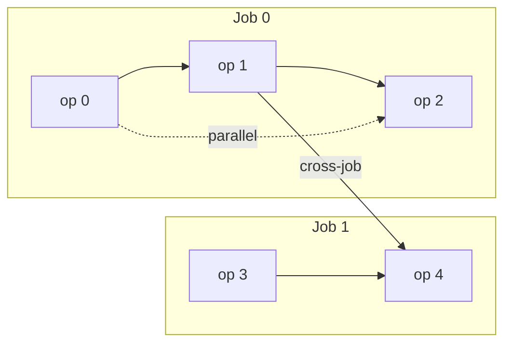

# FJSP PPO

Deep Reinforcement Learning for **Flexible Job Shop Scheduling (FJSP)** using:

- Stable-Baselines3 **PPO**
- PyTorch / PyTorch Geometric
- Gymnasium
- CUDA / Apple Metal (MPS), with CPU fallback

The environment state is a PyTorch Geometric `HeteroData` graph. A custom SB3 policy encodes the graph with heterogeneous convolutions, scores machine–operation pairs with an `EdgePredictor` (including compatibility efficiency), and masks invalid actions with `-1e9` before sampling. The agent is **constructive**: each `step()` assigns one eligible `(machine, operation)` pair until every operation is scheduled. Training uses a lower-bound reward; evaluation and baselines report classic earliest-start $C_{\mathrm{max}}$.

**Supported Python:** 3.10–3.13.

Default training/eval is **demo-scale** (`DEBUG_SCALE_ENV`: `5` machines × `3` jobs × `4` avg ops, short PPO run) so training can be verified quickly. For a serious run, pass `--full-scale` (`FULL_SCALE_ENV` `25×15×8`, 2 097 152 steps, artifacts under `./checkpoints_full`). Measure FPS / RSS / GPU first:

```bash
python benchmark.py
python benchmark.py --full-scale --n-env-steps 64 --dummy-vec
```

---


## Problem

**Job Shop Scheduling (JSP)** assigns each operation to a single predetermined machine. Jobs are linear chains: operation *k*+1 of a job cannot start until operation *k* finishes.

**Flexible Job Shop Scheduling (FJSP)** relaxes the machine constraint. Each operation may run on a subset of machines, usually with different processing times. The decision at every assignment is both *which ready operation* and *which eligible machine*.

This project's instance generator is richer than textbook FJSP:

- **Efficiency.** Eligible machine–operation pairs get a speed multiplier ~N(1, σ) clamped to [0.5, 1.5]. Processing time is `duration × efficiency` (higher factor = slower). Eligibility itself is sparse: each op keeps at least `min(min_eligible_machines, n_machines)` machines, then extra connections are dropped with `connection_drop_prob`.
- **Multiple successors.** After the sequential job chain, extra within-job `parallel` precedences may link an op to later ops in the same job (`shared_dep_prob`). One task can have several successors, and a later task several predecessors.
- **Cross-job DAG.** Additional precedences may link operations of different jobs (`cross_job_dep_prob`). Edges are rejected if they would cycle or duplicate an existing path.

Toy instance (two jobs). Solid arrows are sequential; dashed is a parallel (extra successor in the same job); the labeled edge is cross-job. An operation is mask-ready once every predecessor has **started**.




The policy never outputs a full timetable. It builds a schedule **one assignment at a time** under a ready-operation mask.

---


## Approach

Pipeline:

1. **Graph** — live `HeteroData` of operations and machines (node features + typed edges).
2. **Encoder** — heterogeneous Transformer convolutions produce node embeddings.
3. **Masked logits** — an `EdgePredictor` scores every `(machine, operation)` pair; invalid actions get `-1e9`.
4. **PPO** — `GraphPPO` updates the shared encoder / actor / critic from those masked categoricals.
5. **Classic $C_{\mathrm{max}}$** — evaluation decodes the assignment sequence into earliest-start completion times and reports the latest finish. That is the same objective the MILP minimizes.

Action encoding: `action = machine_id * n_operations + operation_id`.

---


## Environment

`FJSPEnv` (`envs/fjsp_env.py`) is a Gymnasium env. Seedless `reset()` samples a **new instance** by default so vectorized training sees diverse graphs (`reuse_instance` is the fast cached path).

**Sampling.** Operations are partitioned into `n_jobs` non-empty sequences (Poisson sizes around `avg_operations_per_job`). Durations are log-normal, clamped to `[time_step, max_operation_duration]`. Then eligibility, efficiency, sequential / parallel / cross-job edges are drawn as above.

**Node features**


| Node      | Dim | Contents                                                                                                                                                                                 |
| --------- | --- | ---------------------------------------------------------------------------------------------------------------------------------------------------------------------------------------- |
| operation | 12  | duration; sequential / parallel / cross-job incoming-dep counts; scheduled / processing / finished; remaining time; critical-path remaining; job remaining work and op count; ready flag |
| machine   | 3   | queue length, remaining workload, idle duration                                                                                                                                          |


**Edges** (encoder also uses the reverse of each type):


| Type                             | Meaning                                   | Edge attr                                        |
| -------------------------------- | ----------------------------------------- | ------------------------------------------------ |
| `operation —precede→ operation`  | Static instance DAG                       | type code: sequential=1, parallel=2, cross-job=3 |
| `operation —compatible→ machine` | Eligibility                               | efficiency multiplier                            |
| `machine —processing→ operation` | Ops currently queued on that machine      | efficiency of the assignment                     |
| `operation —next→ operation`     | FIFO successor on one machine (see below) | —                                                |


`next` vs `precede`. `precede` is the instance DAG and never changes meaning. `next` starts empty and is built as the agent assigns: if machine *m* already has a queue `… → A` and the policy then puts *B* on *m*, the env adds `A —next→ B`. That chain is the disjunctive machine order (who waits behind whom). The encoder also sees the reverse `previous`. Finished ops drop their `next` / `processing` edges.

**Assign vs process.** These two gates are not the same. The **action mask** lets the agent **assign** an unscheduled successor as soon as every `precede` predecessor has **started** (scheduled, processing, or finished — not necessarily finished) **and** a machine is eligible. Empty masks fail the episode. Assignment only queues the op. **Processing** still waits: only the **front** of each machine queue may run, and only after its `precede` predecessors have **finished**; later `next` successors sit in the queue.

**Discrete ticks.** After each assignment the clock advances by a fixed `time_step`. Only actual processed work is subtracted from remaining durations / machine workload; unused fractional tick capacity is **not** transferred to the next queued operation in the same tick. Terminal `rollout()` uses the same tick routine under a FIFO queue assumption.

**Training reward vs eval $C_{\mathrm{max}}$.** PPO sees a shaped signal: `time_penalty × Δ` of a makespan **lower bound** (clock + max of longest machine workload, remaining critical path, and remaining work / machines). Failures add a large penalty. Evaluation does **not** score the env tick clock. It reconstructs earliest-start $C_{\mathrm{max}}$ from the inferred `(op, machine)` sequence — the same metric as the random, heuristic, MILP, and LP-rounding baselines.

---


## Model


| Piece                    | Role                                                                                                                                                                                                          |
| ------------------------ | ------------------------------------------------------------------------------------------------------------------------------------------------------------------------------------------------------------- |
| `GraphEncoder`           | Projects op/machine features, runs residual `HeteroConv` / `TransformerConv` layers, attention-pools both node types into a graph embedding. Time columns are scaled by per-graph mean duration.              |
| `EdgePredictor`          | Scores every machine–operation pair (default **bilinear**, optional dot-product). A learned bias uses ECT-style compatibility scores (`-expected_completion / mean_duration`) from the efficiency edge attrs. |
| Critic                   | MLP on the pooled graph embedding → scalar *V*(*s*).                                                                                                                                                          |
| `GraphActorCriticPolicy` | SB3 policy: encoder → masked categorical actor + critic. Dropout must be `0.0` so PPO likelihoods stay deterministic.                                                                                         |


**Why** `GraphPPO` **exists.** Stock SB3 `PPO.collect_rollouts` calls `obs_as_tensor`, which cannot convert `HeteroData`. `GraphPPO` swaps in a graph-safe conversion and defaults the buffer to `GraphDictRolloutBuffer`, which stores graphs as objects instead of flattening them.

---


## Baselines

All of these report the **same** successful-episode classic $C_{\mathrm{max}}$ (earliest-start feasible schedule). With the same `--seed` and env size, episode *i* is also the **same instance** as in `evaluate.py` (seed `S+i`). The Gym env is only a sequential decoder (ready mask).


| Baseline          | What it does                                                                                                                                                                                               |
| ----------------- | ---------------------------------------------------------------------------------------------------------------------------------------------------------------------------------------------------------- |
| Random            | Uniform sample among `action_mask` entries (`baseline_random.py`).                                                                                                                                         |
| Dispatching rules | Named heuristics over the same mask: `SPT`, `LPT`, `MWKR`, `LWKR`, `MOR`, `LOR`, `FIFO`, `MFE`, `LFE`, `SQ`, `LWQM`, `ECT` (`baseline_heuristic.py`). Ties → lowest flat action index.                     |
| MILP              | Exact PuLP+CBC makespan model on each held-out instance (`baseline_milp.py`). Eligibility, `duration × efficiency` processing times, and the full `precede` DAG. Only **Optimal** solves count as success. |
| LP-rounding       | Assignment LP + rounding + LRPT/CP insertion list scheduling (`baseline_lp.py`).                                                                                                                           |


CLI details are in the sections below.

---


## Installation


### 1. Create an environment

```bash
python -m venv .venv

# Windows
.venv\Scripts\activate

# Linux / macOS
source .venv/bin/activate

pip install --upgrade pip
```


### 2. Install PyTorch (2.10+)

Pick the build that matches your system ([pytorch.org](https://pytorch.org)):

```bash
# CUDA 12.6 example (Linux / Windows)
pip install torch==2.10.0 torchvision torchaudio --index-url https://download.pytorch.org/whl/cu126

# macOS (Apple Silicon / Metal MPS) — use the default macOS wheel
pip install torch==2.10.0 torchvision torchaudio

# CPU-only example
pip install torch==2.10.0 torchvision torchaudio --index-url https://download.pytorch.org/whl/cpu
```

On Mac, avoid the `+cpu` index URL if you want Metal acceleration; the default wheel includes MPS.

### 3. Install PyTorch Geometric (2.7+)

```bash
pip install "torch-geometric>=2.7.0,<2.9.0"

# Optional compiled extensions (match your torch + CUDA/CPU tag)
# CUDA 12.6 / Torch 2.10:
pip install pyg_lib torch_scatter torch_sparse -f https://data.pyg.org/whl/torch-2.10.0+cu126.html

# CPU / macOS:
pip install pyg_lib torch_scatter torch_sparse -f https://data.pyg.org/whl/torch-2.10.0+cpu.html
```


### 4. Install remaining dependencies

```bash
pip install -r requirements.txt
# Optional: tests / security audit tooling
pip install -r requirements-dev.txt
```


### 5. Verify

```bash
python -c "import torch; import torch_geometric; import gymnasium; import stable_baselines3; print('ok', torch.__version__, 'cuda', torch.cuda.is_available(), 'mps', getattr(torch.backends, 'mps', None) and torch.backends.mps.is_available())"
python -m pytest -q
```

---


## Training

From the project root (`fjsp_ppo/`):

```bash
python train.py
```

Training **starts fresh by default** (`resume=False`) on the **demo-scale** instance (`5×3×4`, 65k steps). Pass `--full-scale` for `25×15×8` + 2 097 152 steps (writes `./checkpoints_full`, not the demo zips). Each run trains at **one configured point size** (`--n-machines` / `--n-jobs` / `--avg-ops` or the demo / full-scale presets). Instance size is **not** sampled on reset.

To continue from a trusted local checkpoint:

```bash
python train.py --resume --trust-checkpoint
```

`--trust-checkpoint` is required for any SB3 ZIP load. **SB3/cloudpickle checkpoints are executable input** — only load files you created. This project does **not** claim third-party ZIPs are safe.

Useful overrides:

```bash
# Fewer parallel envs / shorter smoke run
python train.py --n-envs 2 --dummy-vec --total-timesteps 8192

# Explicit demo-scale (same as the default)
python train.py --debug --dummy-vec

# Documented parallel presets
python train.py --n-envs 8

# Device and seed (auto picks CUDA, then Apple MPS, then CPU)
python train.py --device cuda --seed 123
python train.py --device mps --seed 123

# Larger instance
python train.py --n-machines 10 --n-jobs 8 --avg-ops 6

# Full-scale instance (25×15×8, 2**21 steps, ./checkpoints_full)
python train.py --full-scale
python evaluate.py --full-scale --trust-checkpoint
python baseline_random.py --full-scale
```

All hyperparameters live in `config.py` (`TrainConfig`, `EnvConfig`, `ModelConfig`, `PPOConfig`).

**Checkpoint compatibility:** Resume still fingerprints the **training** env point size, model dims, and PPO batching — you cannot resume a `5×3×4` run as `25×15×8`. `--full-scale` writes `./checkpoints_full/` so demo zips under `./checkpoints/` are left alone.

**Size-agnostic inference (not mixed-size training).** The GNN has no weights tied to `n_machines` or `n_operations`. Gym `action_space` is dummy `Discrete(2)` (SB3's unused head); live arity is `n_machines * n_operations` on the graph, carried by `action_mask`. A zip trained at one point size can be evaluated at another:

```bash
python evaluate.py --trust-checkpoint --n-machines 10 --n-jobs 8 --avg-ops 6
python compare_baselines.py --trust-checkpoint --n-machines 10 --n-jobs 8 --avg-ops 6
```

Zips saved with `Discrete(n_actions)` / a fixed-length mask `Box` will not load — retrain. Mixed-size PPO minibatches and sampling `n_machines` / `n_jobs` / `avg_ops` on reset are out of scope.

### Discrete tick semantics

Each `step()` assigns one operation, then advances simulated time by a fixed `time_step`. Only actual processed work is subtracted from remaining durations / machine workload; unused fractional tick capacity is **not** transferred to the next queued operation in the same tick. Terminal `rollout()` uses the same tick routine.

---


## Evaluation

```bash
python evaluate.py --trust-checkpoint
python evaluate.py --model-path ./checkpoints/best_model.zip --n-episodes 20 --trust-checkpoint
python evaluate.py --stochastic --trust-checkpoint
python evaluate.py --trust-checkpoint --n-machines 10 --n-jobs 8 --avg-ops 6
```

Printed metrics:

- **Successful-episode makespan** (± std) — classic FJSP $C_{\mathrm{max}}$ of the inferred `(op, machine)` sequence (same objective as MILP / LP-rounding) 
- Episode length (± std)
- Success rate
- Success / failure / timeout counts
- Mean inference time (ms/step)

The Gym env is only a sequential decoder (ready operations + action mask). Evaluation does **not** score the env tick clock.

**Held-out instances.** Episode *i* is generated from seed `S+i` (`n_envs=1`). That stream is identical across `evaluate.py`, `baseline_random.py`, `baseline_heuristic.py`, `baseline_milp.py`, `baseline_lp.py`, and `compare_baselines.py` when `--seed` and env size match — same jobs, durations, eligibility, efficiency, and DAG; the assignment sequence can still differ. Episodes in one run are not copies of each other. Training-time eval uses `eval_seed = train.seed + 1_000_000` (1 000 042 if `seed=42`). `evaluate.py --full-scale` defaults to that held-out seed. Demo eval still defaults to seed 42; pass `--seed 1000042` to match a demo training eval.

Path resolution:

- Explicit `--model-path` never falls back if missing.
- The configured `best_model.zip` may fall back to a sibling `latest_model.zip` in the same directory (`./checkpoints/` for demo, `./checkpoints_full/` for `--full-scale`).

---


## Random baseline

```bash
python baseline_random.py
python baseline_random.py --n-episodes 20 --seed 123
python baseline_random.py --n-machines 10 --n-jobs 8 --avg-ops 6
```

Samples uniformly among valid actions from `action_mask`. Empty masks fail fast. Reports classic instance $C_{\mathrm{max}}$ of the inferred assignment sequence (same metric schema as `evaluate.py`, no PPO checkpoint).

## Heuristic baselines

Classic FJSP dispatching rules over the valid action mask (ties → lowest flat action index):

`SPT`, `LPT`, `MWKR`, `LWKR`, `MOR`, `LOR`, `FIFO`, `MFE`, `LFE`, `SQ`, `LWQM`, `ECT`.

```bash
python baseline_heuristic.py --rule SPT
python baseline_heuristic.py --rule MWKR --n-episodes 20 --seed 123
python baseline_heuristic.py --all --n-episodes 5
python baseline_heuristic.py --rule ECT --n-machines 10 --n-jobs 8 --avg-ops 6
```

Requires in-process `GraphDummyVecEnv` (`n_envs=1`). Same classic-instance $C_{\mathrm{max}}$ as `evaluate.py` / the random baseline.

## MILP baseline (exact)

Offline PuLP+CBC makespan MILP on each held-out instance (`eval_seed + episode_index`). Uses eligibility, `duration × efficiency` processing times, and the full `precede` DAG. Only **Optimal** solves count as success.

```bash
python baseline_milp.py
python baseline_milp.py --n-episodes 5 --seed 42
python baseline_milp.py --time-limit 30 --n-machines 5 --n-jobs 3 --avg-ops 4
```

Demo-scale instances are the intended target; larger instances may need `--time-limit` and may not prove optimality.

## LP-rounding baseline (relaxation + heuristic)

Offline assignment LP + rounding + insertion list scheduling on each held-out instance (`eval_seed + episode_index`). Same eligibility, `duration × efficiency` processing times, and `precede` DAG as the MILP. This is **not** a proven approximation algorithm.

**LP relaxation** (PuLP+CBC, continuous). Minimize `Cmax` with:

- `x[i,m] ∈ [0,1]` on eligible machines, `Σ_m x[i,m] = 1`
- start times `S[i] ≥ 0` and job-DAG precedence `S[j] ≥ S[i] + Σ_m p[i,m] x[i,m]`
- `Cmax ≥ S[i] + Σ_m p[i,m] x[i,m]`
- machine-load inequalities `Σ_i p[i,m] x[i,m] ≤ Cmax`

Integer assignment `x ∈ {0,1}` is relaxed to `[0,1]`. Exact disjunctive sequencing (the MILP's binary `y` / big-M pairs) is **not** LP-relaxed in place — those big-M constraints are nearly vacuous when `y` is continuous. The load inequalities are valid: every feasible integral schedule satisfies them, so `LB_LP ≤ OPT` up to solver tolerance. The bound can be strict.

**Rounding.** Trial 0 is largest-fraction (`argmax_m x[i,m]`, ties → lowest machine). Extra `--rounding-trials` draw machines from `x[i,·]` with `--seed`. The LP is solved once; only rounding/list scheduling repeats.

**List scheduling.** Each integral assignment is decoded with insertion list scheduling (ready ops only; earliest feasible gap on the assigned machine, not append-only). Reconstruction tries `LRPT` and `CP` and keeps the lowest classic $C_{\mathrm{max}}$ — the same earliest-start objective as MILP / eval.

`baseline_lp.py` prints per-instance `LB_LP`, feasible $C_{\mathrm{max}}$, and the empirical ratio $C_{\mathrm{max}} / LB_{\mathrm{LP}}$ (not a proven approximation factor). The sandwich is `LB_LP ≤ OPT ≤ C_max`. `compare_baselines.py` reports only the same columns as the other methods (makespan, std, success, episode length, ms/ep).

CBC is used as an LP solver. Same instance + seed + trials + PuLP/CBC version is deterministic given fixed variable order; alternative optimal bases can still yield different fractional `x` with the same `LB_LP`.

```bash
python baseline_lp.py
python baseline_lp.py --n-episodes 5 --seed 42 --rounding-trials 20
python baseline_lp.py --compare-milp --n-episodes 5 --verbose
python baseline_lp.py --time-limit 30 --n-machines 5 --n-jobs 3 --avg-ops 4
```

`--compare-milp` runs the existing exact solver **once per instance** (not per rounding trial) and prints `OPT`, `(OPT - LB_LP)/OPT`, and `(C_max - OPT)/OPT` when CBC proves optimality.

## PPO vs all baselines

Same held-out stream (`--seed`, env size) for PPO, random, every dispatching rule, MILP, and LP-rounding. The table uses the same columns for every method. LP reconstruction is listed as `LP-LRPT` and `LP-CP` (both always shown). LP bound / ratio columns are only in `baseline_lp.py`.

```bash
python compare_baselines.py --trust-checkpoint
python compare_baselines.py --trust-checkpoint --seed 1000042 --n-episodes 20
python compare_baselines.py --trust-checkpoint --rounding-trials 20 --time-limit 30
```

`--seed 1000042` matches this repo's demo checkpoint (`train.seed=123`, `eval_seed = seed + 1_000_000`). `ms/ep` is mean wall time per instance (constructive methods: step latency × episode length; MILP/LP: solver time).

---


## Rollout baseline

Times `policy.predict` + `env.step` and reports FPS, process RSS, CUDA allocation, and GPU util (nvidia-smi when present). Demo-scale stays the train default; use this before `--full-scale`.

```bash
python benchmark.py --n-env-steps 64
python benchmark.py --full-scale --n-env-steps 64 --device cuda
```

---


## TensorBoard

```bash
tensorboard --logdir ./logs
```

Logged signals include policy/value/entropy losses, learning rate, episode reward/length, success rate, successful-episode makespan, gradient norm, and FPS.

---


## Checkpointing

Checkpoints are written under `./checkpoints/` (demo) or `./checkpoints_full/` (`--full-scale`):


| File                         | Meaning                                |
| ---------------------------- | -------------------------------------- |
| `latest_model.zip`           | Most recent training snapshot          |
| `latest_model.zip.meta.json` | Config fingerprint + save metadata     |
| `best_model.zip`             | Best eval mean makespan                |
| `best_score.json`            | Persisted best score (survives resume) |


- Saves / evals fire on **completed PPO update** boundaries.
- Final policy is evaluated and saved at training end.
- Resume is **opt-in** (`--resume --trust-checkpoint`) and rejects fingerprint mismatches.

---


## Project structure

```text
fjsp_ppo/
  train.py                 # Training entry point
  evaluate.py              # Evaluation entry point
  baseline_random.py       # Uniform random valid-action baseline
  baseline_heuristic.py    # Classic dispatching-rule baselines
  baseline_milp.py         # Exact makespan MILP (PuLP+CBC)
  baseline_lp.py           # LP relaxation + rounding/list-scheduling baseline
  compare_baselines.py     # PPO vs random / heuristic / MILP / LP-rounding
  benchmark.py             # FPS / RSS / GPU baseline
  config.py                # All hyperparameters + validation
  callbacks.py             # Checkpoint / eval / TB / LR callbacks
  monitor.py               # Episode statistics (append-safe CSV)
  utils.py                 # Seeds, device, unflatten_action, logging
  requirements.txt
  requirements-dev.txt
  README.md
  heuristics/
    dispatch_rules.py      # SPT/LPT/MWKR/... action selection
  solvers/
    milp.py                # FJSP instance extract + MILP solve
    lp_rounding.py         # Assignment LP + rounding
    list_scheduler.py      # LRPT/CP insertion list scheduling
  envs/
    fjsp_env.py            # Gymnasium-native FJSP environment
  models/
    edge_predictor.py      # Machine–operation scorer (+ efficiency)
    graph_encoder.py       # HeteroConv encoder
    actor_critic.py        # Graph actor-critic
    sb3_policy.py          # GraphActorCriticPolicy for SB3
    graph_ppo.py           # PPO subclass for HeteroData rollouts
  training/
    make_env.py            # VecEnv factories (Dummy / Subproc)
    evaluate.py            # Shared eval metrics
    eval_cli.py            # Shared evaluate/baseline CLI helpers
    graph_buffer.py        # Object-safe rollout buffer for graphs
    checkpoints.py         # Atomic metadata-backed checkpoint helpers
    benchmark.py           # Rollout FPS / RSS / GPU snapshot
  logs/
  checkpoints/
  tests/
```


### Design notes

- **Native Gymnasium env:** `envs/fjsp_env.py` implements `FJSPEnv` directly.
- **No graph flattening:** observations carry slim `HeteroData` plus an action mask.
- **SB3 integration:** `GraphPPO` + `GraphDictRolloutBuffer` store graphs as objects.
- **Action encoding:** `action = machine_id * n_operations + operation_id`. Gym `action_space` is dummy `Discrete(2)`; live arity is the mask.
- **Invalid actions:** logits masked with `-1e9`; empty masks raise (value-only bootstrap still allowed).
- **Size-agnostic load:** evaluate a zip at a different `--n-machines` / `--n-jobs` / `--avg-ops`. Train stays a single point size.
- **Deterministic PPO:** policy dropout must be `0.0`.

---


## Troubleshooting


### Windows + `SubprocVecEnv`

Always launch via `python train.py` (the `if __name__ == "__main__"` guard is required for spawn). If subprocess workers hang:

```bash
python train.py --dummy-vec --n-envs 2
```


### CUDA OOM / slow starts

- Keep env tensors on CPU (default in `make_env`); only the policy uses GPU.
- Lower `--n-envs`, `hidden_dim`, `n_steps`, or `batch_size`.


### Resume / trust errors

- Pass `--resume --trust-checkpoint` only for local checkpoints you trust.
- Fingerprint mismatches mean config drifted; start fresh or restore the matching config.
- Zips from before dummy `Discrete(2)` / opaque mask spaces will not load; retrain.


### Empty valid-action mask

Empty masks terminate episodes / fail evaluation. Check gridlock and dependency readiness.

---


## Tests

```bash
python -m pytest -q
```

CI (`.github/workflows/test.yml`) runs pytest on Python 3.11 and 3.12 for every push and pull request (CPU torch wheel). Dev extras are in `requirements-dev.txt` (`pytest`, `pip-audit`).

---


## License

[MIT](LICENSE). Scheduling dynamics live in `envs/fjsp_env.py` as a Gymnasium-native FJSP environment for Stable-Baselines3 PPO training.