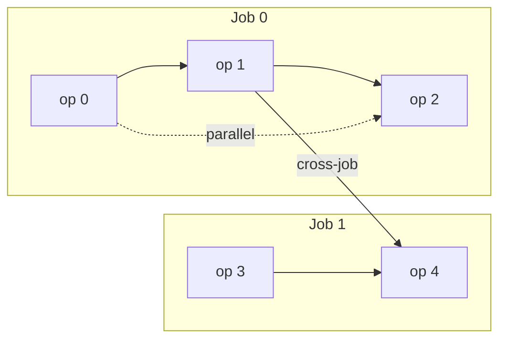
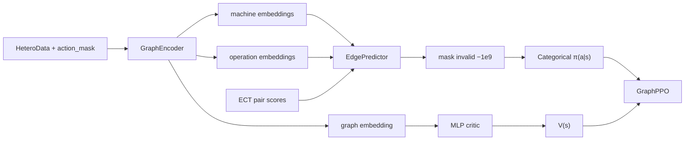

# FJSP PPO

Deep Reinforcement Learning for **Flexible Job Shop Scheduling (FJSP)** using Stable-Baselines3 **PPO**, PyTorch Geometric `HeteroData`, and Gymnasium (CUDA / Apple Metal / CPU).

**Supported Python:** 3.10–3.13.

Default training/eval is **demo-scale** (`5×3×4`, short PPO run). `--full-scale` is `25×15×8`, 2 097 152 steps (same `./checkpoints` / `./logs` — size-agnostic policy). Measure FPS / RSS / GPU first:

```bash
python benchmark.py
python benchmark.py --full-scale --n-env-steps 64 --dummy-vec
```

## Contents

- [Problem](#problem)
- [Approach](#approach)
- [Environment](#environment)
- [Actor-critic PPO](#actor-critic-ppo)
- [Hyperparameters](#hyperparameters)
- [Baselines](#baselines)
- [Installation](#installation)
- [Training](#training)
- [Evaluation](#evaluation)
- [Random baseline](#random-baseline)
- [Heuristic baselines](#heuristic-baselines)
- [MILP baseline (exact)](#milp-baseline-exact)
- [LP-rounding baseline](#lp-rounding-baseline-relaxation--heuristic)
- [PPO vs all baselines](#ppo-vs-all-baselines)
- [Rollout baseline](#rollout-baseline)
- [TensorBoard](#tensorboard)
- [Checkpointing](#checkpointing)
- [Project structure](#project-structure)
- [Troubleshooting](#troubleshooting)
- [Tests](#tests)

---

## Problem

**Job Shop Scheduling (JSP)** assigns each operation to a single predetermined machine. Jobs are linear chains: operation *k*+1 of a job cannot start until operation *k* finishes.

**Flexible Job Shop Scheduling (FJSP)** relaxes the machine constraint. Each operation may run on a subset of machines, usually with different processing times. The decision at every assignment is both *which ready operation* and *which eligible machine*. Minimizing makespan on FJSP is **NP-hard** (it generalizes classical JSP), so exact MILP does not scale and learning / heuristics are the practical route.

This project's instance generator is richer than textbook FJSP:

- **Efficiency.** Eligible machine–operation pairs get a speed multiplier ~N(1, σ) clamped to [0.5, 1.5]. Processing time is `duration × efficiency` (higher factor = slower). Eligibility itself is sparse: each op keeps at least `min(min_eligible_machines, n_machines)` machines, then extra connections are dropped with `connection_drop_prob`.
- **Multiple successors.** After the sequential job chain, extra within-job `parallel` precedences may link an op to later ops in the same job (`shared_dep_prob`).
- **Cross-job DAG.** Additional precedences may link operations of different jobs (`cross_job_dep_prob`). Edges are rejected if they would cycle or duplicate an existing path.

Toy instance (two jobs). Solid arrows are sequential; dashed is a parallel (extra successor in the same job); the labeled edge is cross-job. An operation is mask-ready once every predecessor has **started**.



The policy never outputs a full timetable. Each `step()` assigns one eligible pair, the graph updates (queue edges, remaining times, ready flags), and this repeats until every operation is scheduled.

---

## Approach



Shared encoder → masked pair logits (actor) + graph value (critic) → PPO. Action index is `machine_id * n_operations + operation_id` (Gym `action_space` is dummy `Discrete(2)`; live arity is the mask). Evaluation reports classic earliest-start $C_{\mathrm{max}}$ of that assignment sequence — the same objective the MILP minimizes.

---

## Environment

`FJSPEnv` (`envs/fjsp_env.py`) is a Gymnasium env. Seedless `reset()` samples a **new instance of the same point size** (`n_machines` / `n_jobs` / `avg_ops` are fixed for a run) so vectorized training sees diverse graphs. `reuse_instance` is the fast cached path.

**Sampling.** Operations are partitioned into `n_jobs` non-empty sequences (Poisson sizes around `avg_operations_per_job`). Durations are log-normal, clamped to `[time_step, max_operation_duration]`. Then eligibility, efficiency, sequential / parallel / cross-job edges are drawn as in [Problem](#problem).

**Observation dict.** The policy consumes this directly; nothing is flattened into a vector.

| Key           | Type                    | Role                                                               |
| ------------- | ----------------------- | ------------------------------------------------------------------ |
| `graph`       | `HeteroData`            | Live instance + schedule state                                     |
| `action_mask` | `float32 [n_m × n_ops]` | `1` = assignable pair; live length, not part of the Gym space      |
| `dummy`       | `float32 [1]`           | SB3 feature-extractor placeholder; unused by the graph policy      |

**Node features**

| Node      | Dim | Columns (index) |
| --------- | --- | --------------- |
| operation | 12  | `0` duration; `1–3` sequential / parallel / cross-job incoming-dep counts; `4–6` scheduled / processing / finished; `7` remaining time; `8` critical-path remaining; `9–10` job remaining work and op count; `11` ready flag |
| machine   | 3   | `0` queue length; `1` remaining workload; `2` idle duration |

**Edges** (encoder also uses the reverse of each type: `succeed`, `previous`, `processed_by`, `compatible_with`):

| Type                             | Meaning                                   | Edge attr                                        |
| -------------------------------- | ----------------------------------------- | ------------------------------------------------ |
| `operation —precede→ operation`  | Static instance DAG                       | type code: sequential=1, parallel=2, cross-job=3 |
| `operation —compatible→ machine` | Eligibility                               | efficiency multiplier                            |
| `machine —processing→ operation` | Ops currently queued on that machine      | efficiency of the assignment                     |
| `operation —next→ operation`     | FIFO successor on one machine (see below) | —                                                |

`precede` is the instance DAG and never changes meaning. `next` starts empty and is built as the agent assigns: if machine *m* already has a queue `… → A` and the policy then puts *B* on *m*, the env adds `A —next→ B`. Finished ops drop their `next` / `processing` edges.

**Assign vs process.** The **action mask** lets the agent **assign** an unscheduled successor as soon as every `precede` predecessor has **started** (not necessarily finished) **and** a machine is eligible. Empty masks fail the episode. Assignment only queues the op. **Processing** waits: only the **front** of each machine queue may run, and only after its `precede` predecessors have **finished**.

**No circular wait.** The mask forces assignment order to be a topological order of `precede`. Machine queues are FIFO, so a later assignment on the same machine waits on an earlier one. Both wait relations point backward in assignment order, so some queued front can always run. A successor idle on one machine while its predecessor is still processing elsewhere is delay, not deadlock. Episodes last at most `n_operations` assignments.

**Discrete ticks.** After each assignment the clock advances by a fixed `time_step`. Only actual processed work is subtracted from remaining durations / machine workload; unused fractional tick capacity is **not** transferred to the next queued operation in the same tick. Terminal `rollout()` uses the same tick routine under a FIFO queue assumption. The tick clock is a simulator, not the training objective.

**Reward.** PPO sees `time_penalty × Δ` of running earliest-start $C_{\mathrm{max}}$ (updated on each assignment; FIFO `rollout()` adds nothing). Packing into idle is 0; extending the current peak is negative. Failures add `time_penalty × n_ops × max_operation_duration × 1.5 × 2`. Eval and all baselines report that same classic $C_{\mathrm{max}}$, not the tick clock.

---

## Actor-critic PPO

On-policy PPO with a **shared graph encoder**, a **masked categorical actor**, and a **scalar critic**.

### Shared encoder (`GraphEncoder`)

Projects op / machine features, lifts 1-D edge attrs into `hidden_dim`, then stacks `num_layers` residual heterogeneous `TransformerConv` blocks (pre-LN attention + type-specific FFN `H→4H→H`, last linear zero-init). LayerScale starts small so extra hops do not blow up PPO KL at init.

Time columns are divided by per-graph mean duration. Attention-pools operations and machines, concatenates, and maps through a graph MLP to one vector $h_G$. CUDA/MPS encoding uses autocast; embeddings are cast back to fp32 before the actor/critic.

### Actor (`EdgePredictor`)

Scores every machine–operation pair in the same flat order as the env (`machine_id * n_operations + operation_id`, row-major over machines).

- GraphNorm on both sides, then **bilinear** (default) or scaled **dot-product**. Scores are divided by $\sqrt{2H}$ so init logits stay cool (hot logits collapse entropy).
- Learned ECT residual: expected completion is `machine_workload + duration × efficiency`. Pair scores are `-ECT / mean_duration`; a scalar `efficiency_scale` (init `0.1`) adds them to the GNN logits. Weak greedy-dispatch prior, not a hard constraint.
- Invalid pairs (mask `< 0.5`) get logit `-1e9`. Empty masks raise on action sampling; **value-only** terminal bootstrap still runs.

Same-size batches (PPO minibatches) stack embeddings and score in one matmul. Mixed `(M, N)` graphs pad logits with `-1e9`; those padded rows are not used as PPO minibatches.

### Critic

MLP on $h_G$: `Linear(H, critic_hidden) → LayerNorm → GELU → Linear → GELU → Linear → 1`. $V(s)$ is the GAE baseline for remaining makespan cost. `get_value()` skips the actor when SB3 only needs a bootstrap at episode end.

### SB3 policy (`GraphActorCriticPolicy`)

SB3 MLP heads are off (`net_arch=[]`). A dummy feature extractor exists only because SB3 requires one; live compute uses `obs["graph"]`.

| Hook               | Returns                                              |
| ------------------ | ---------------------------------------------------- |
| `forward`          | sample $a$, $V(s)$, $\log\pi(a\|s)$                  |
| `evaluate_actions` | $V(s)$, $\log\pi(a\|s)$, entropy for the PPO update  |
| `predict_values`   | critic only (empty masks allowed)                    |

Stock SB3 `PPO.collect_rollouts` calls `obs_as_tensor`, which cannot convert `HeteroData`. `GraphPPO` patches that conversion for the rollout loop and stores graphs as objects in `GraphDictRolloutBuffer`.

### Update

1. Roll out `n_steps` per env: sample a masked assignment, step, store $(s, a, r, \log\pi_{\mathrm{old}}, V)$.
2. GAE advantages. **`gamma=1` and `gae_lambda=1`**: makespan is finite-horizon and undiscounted; $\lambda<1$ would hide early assignments.
3. For `n_epochs`, maximize clipped PPO + entropy − `vf_coef ×` value error. Clip $\epsilon=0.2$.
4. Stop an epoch early if approximate KL exceeds `target_kl`.

`vf_coef` is `0.1` so the shared encoder is not dominated by the value head. Policy dropout must be `0.0`: stochastic dropout would make $\log\pi$ differ between rollout and the update.

---

## Hyperparameters

All knobs live in `config.py`. CLI flags override a subset. `batch_size` must divide `n_steps * n_envs`.

| | Demo (`python train.py`) | Full-scale (`--full-scale`) |
| --- | --- | --- |
| Instance | `5×3×4` | `25×15×8` |
| Steps | 65 536 | 2 097 152 |
| Envs | 2 | 8 |
| Encoder | $H=64$, 3 layers, 2 heads | $H=128$, 4 layers, 8 heads |
| Critic hidden | 128 | 256 |
| LR | $2\times10^{-4}$, linear → 80% | $10^{-4}$, linear → 30% |
| `n_steps` / `batch_size` / epochs | 256 / 64 / 6 | 512 / 256 / 4 |
| `ent_coef` / `target_kl` | 0.01 / 0.02 | 0.02 / 0.015 |
| Checkpoints / TB | `./checkpoints`, `./logs` | same |

Shared unless overridden: `gamma=1`, `gae_lambda=1`, `clip_range=0.2`, `vf_coef=0.1`, `max_grad_norm=5`, `dropout=0`, bilinear predictor, `best_metric=mean_makespan`. VecEnv: `GraphSubprocVecEnv` when `n_envs>1` on CPU; `GraphDummyVecEnv` on CUDA/MPS unless `--subproc`. Env tensors stay on CPU; only the policy uses the accelerator.

---

## Baselines

Same successful-episode classic $C_{\mathrm{max}}$ as [Evaluation](#evaluation). With matching `--seed` and env size, episode *i* is the **same instance** (seed `S+i`); the assignment sequence can still differ.

| Baseline          | What it does |
| ----------------- | ------------ |
| Random            | Uniform sample among `action_mask` entries (`baseline_random.py`) |
| Dispatching rules | 12 named heuristics over the same mask; ties → lowest flat index (`baseline_heuristic.py`) |
| MILP              | Exact PuLP+CBC makespan; only **Optimal** solves count as success (`baseline_milp.py`) |
| LP-rounding       | Assignment LP + rounding + LRPT/CP insertion list scheduling (`baseline_lp.py`) |

---

## Installation

### 1. Create an environment

```bash
python -m venv .venv

# Windows
.venv\Scripts\activate

# Linux / macOS
source .venv/bin/activate

pip install --upgrade pip
```

### 2. Install PyTorch (2.10+)

Pick the build that matches your system ([pytorch.org](https://pytorch.org)):

```bash
# CUDA 12.6 example (Linux / Windows)
pip install torch==2.10.0 torchvision torchaudio --index-url https://download.pytorch.org/whl/cu126

# macOS (Apple Silicon / Metal MPS) — use the default macOS wheel
pip install torch==2.10.0 torchvision torchaudio

# CPU-only example
pip install torch==2.10.0 torchvision torchaudio --index-url https://download.pytorch.org/whl/cpu
```

On Mac, avoid the `+cpu` index URL if you want Metal acceleration; the default wheel includes MPS.

### 3. Install PyTorch Geometric (2.7+)

```bash
pip install "torch-geometric>=2.7.0,<2.9.0"

# Optional compiled extensions (match your torch + CUDA/CPU tag)
# CUDA 12.6 / Torch 2.10:
pip install pyg_lib torch_scatter torch_sparse -f https://data.pyg.org/whl/torch-2.10.0+cu126.html

# CPU / macOS:
pip install pyg_lib torch_scatter torch_sparse -f https://data.pyg.org/whl/torch-2.10.0+cpu.html
```

### 4. Install remaining dependencies

```bash
pip install -r requirements.txt
# Optional: tests / security audit tooling
pip install -r requirements-dev.txt
```

### 5. Verify

```bash
python -c "import torch; import torch_geometric; import gymnasium; import stable_baselines3; print('ok', torch.__version__, 'cuda', torch.cuda.is_available(), 'mps', getattr(torch.backends, 'mps', None) and torch.backends.mps.is_available())"
python -m pytest -q
```

---

## Training

```bash
python train.py
```

Starts fresh by default on demo-scale. `--full-scale` only changes instance size / PPO budget / encoder width — checkpoints and TensorBoard still go under `./checkpoints` and `./logs`. Each run is **one point size** (`--n-machines` / `--n-jobs` / `--avg-ops` or a preset); size is not sampled on reset.

```bash
python train.py --resume --trust-checkpoint
```

`--trust-checkpoint` is required for any SB3 ZIP load. **SB3/cloudpickle checkpoints are executable input** — only load files you created.

```bash
python train.py --n-envs 2 --dummy-vec --total-timesteps 8192
python train.py --debug --dummy-vec
python train.py --n-envs 8
python train.py --device cuda --seed 123
python train.py --device mps --seed 123
python train.py --n-machines 10 --n-jobs 8 --avg-ops 6
python train.py --full-scale
```

**Size-agnostic inference (not mixed-size training).** The GNN has no weights tied to `n_machines` or `n_operations`. A zip trained at one point size can be evaluated at another:

```bash
python evaluate.py --trust-checkpoint --n-machines 10 --n-jobs 8 --avg-ops 6
python compare_baselines.py --trust-checkpoint --n-machines 10 --n-jobs 8 --avg-ops 6
```

Zips saved with `Discrete(n_actions)` / a fixed-length mask `Box` will not load — retrain. Mixed-size PPO minibatches and sampling instance size on reset are out of scope.

---

## Evaluation

```bash
python evaluate.py --trust-checkpoint
python evaluate.py --model-path ./checkpoints/best_model.zip --n-episodes 20 --trust-checkpoint
python evaluate.py --stochastic --trust-checkpoint
python evaluate.py --trust-checkpoint --n-machines 10 --n-jobs 8 --avg-ops 6
```

Printed metrics: successful-episode makespan (± std), episode length, success rate, success / failure / timeout counts, mean inference time (ms/step).

**Held-out instances.** Episode *i* uses seed `S+i` (`n_envs=1`). That stream is identical across `evaluate.py` and every baseline script when `--seed` and env size match. Training-time eval uses `eval_seed = train.seed + 1_000_000` (1 000 042 if `seed=42`). `evaluate.py --full-scale` defaults to that held-out seed. Demo eval still defaults to seed 42; pass `--seed 1000042` to match a demo training eval.

Path resolution: explicit `--model-path` never falls back if missing. Configured `best_model.zip` may fall back to a sibling `latest_model.zip` in the same directory.

---

## Random baseline

```bash
python baseline_random.py
python baseline_random.py --n-episodes 20 --seed 123
python baseline_random.py --n-machines 10 --n-jobs 8 --avg-ops 6
```

Uniform among valid `action_mask` entries. Empty masks fail fast. No PPO checkpoint.

## Heuristic baselines

Ties → lowest flat action index. Processing times use `duration × efficiency`.

| Rule            | Picks the valid pair with…                                 |
| --------------- | ---------------------------------------------------------- |
| `SPT` / `LPT`   | shortest / longest effective processing time               |
| `MWKR` / `LWKR` | most / least remaining job work (unscheduled ops)          |
| `MOR` / `LOR`   | most / least remaining ops in the job                      |
| `FIFO`          | lowest operation index                                     |
| `MFE` / `LFE`   | most / least eligible machines (flexibility)               |
| `SQ`            | shortest machine queue                                     |
| `LWQM`          | least remaining machine workload                           |
| `ECT`           | earliest completion = workload + effective processing time |

`ECT` is the same prior the actor adds as a learned residual (`efficiency_scale` init `0.1`).

```bash
python baseline_heuristic.py --rule SPT
python baseline_heuristic.py --rule MWKR --n-episodes 20 --seed 123
python baseline_heuristic.py --all --n-episodes 5
python baseline_heuristic.py --rule ECT --n-machines 10 --n-jobs 8 --avg-ops 6
```

Requires in-process `GraphDummyVecEnv` (`n_envs=1`).

## MILP baseline (exact)

PuLP+CBC makespan MILP on each held-out instance. Eligibility, `duration × efficiency` processing times, and the full `precede` DAG. Only **Optimal** solves count as success.

```bash
python baseline_milp.py
python baseline_milp.py --n-episodes 5 --seed 42
python baseline_milp.py --time-limit 30 --n-machines 5 --n-jobs 3 --avg-ops 4
```

Demo-scale is the intended target; larger instances may need `--time-limit` and may not prove optimality.

## LP-rounding baseline (relaxation + heuristic)

Assignment LP + rounding + insertion list scheduling on each held-out instance.

**LP relaxation** (PuLP+CBC, continuous). Minimize `Cmax` with:

- `x[i,m] ∈ [0,1]` on eligible machines, `Σ_m x[i,m] = 1`
- start times `S[i] ≥ 0` and job-DAG precedence `S[j] ≥ S[i] + Σ_m p[i,m] x[i,m]`
- `Cmax ≥ S[i] + Σ_m p[i,m] x[i,m]`
- machine-load inequalities `Σ_i p[i,m] x[i,m] ≤ Cmax`

Integer assignment $x$ is relaxed to $[0,1]$. Exact disjunctive sequencing (the MILP's binary `y` / big-M pairs) is **not** LP-relaxed in place — those big-M constraints are nearly vacuous when `y` is continuous. The load inequalities are valid, so `LB_LP ≤ OPT` up to solver tolerance. The bound can be strict.

**Rounding.** Trial 0 is largest-fraction (`argmax_m x[i,m]`, ties → lowest machine). Extra `--rounding-trials` draw machines from `x[i,·]` with `--seed`. The LP is solved once; only rounding/list scheduling repeats.

**List scheduling.** Insertion into the earliest feasible gap on the assigned machine (ready ops only, not append-only). Reconstruction tries `LRPT` and `CP` and keeps the lowest $C_{\mathrm{max}}$.

`baseline_lp.py` prints per-instance `LB_LP` and feasible $C_{\mathrm{max}}$. `compare_baselines.py` reports only the shared columns (makespan, std, success, episode length, ms/ep).

CBC as an LP solver is deterministic given instance + seed + trials + PuLP/CBC version and fixed variable order; alternative optimal bases can still yield different fractional `x` with the same `LB_LP`.

```bash
python baseline_lp.py
python baseline_lp.py --n-episodes 5 --seed 42 --rounding-trials 20
python baseline_lp.py --compare-milp --n-episodes 5 --verbose
python baseline_lp.py --time-limit 30 --n-machines 5 --n-jobs 3 --avg-ops 4
```

`--compare-milp` runs the exact solver **once per instance** and prints `OPT`, `(OPT - LB_LP)/OPT`, and `(C_max - OPT)/OPT` when CBC proves optimality.

## PPO vs all baselines

Same held-out stream as [Evaluation](#evaluation). LP reconstruction is listed as `LP-LRPT` and `LP-CP` (both always shown). LP bound columns are only in `baseline_lp.py`.

```bash
python compare_baselines.py --trust-checkpoint
python compare_baselines.py --trust-checkpoint --seed 1000042 --n-episodes 20
python compare_baselines.py --trust-checkpoint --rounding-trials 20 --time-limit 30
```

`--seed 1000042` matches this repo's demo checkpoint (`train.seed=123`, `eval_seed = seed + 1_000_000`). `ms/ep` is mean wall time per instance (constructive methods: step latency × episode length; MILP/LP: solver time).

---

## Rollout baseline

Times `policy.predict` + `env.step` and reports FPS, process RSS, CUDA allocation, and GPU util (nvidia-smi when present). Use this before `--full-scale`.

```bash
python benchmark.py --n-env-steps 64
python benchmark.py --full-scale --n-env-steps 64 --device cuda
```

---

## TensorBoard

```bash
tensorboard --logdir ./logs
```

Policy/value/entropy losses, approximate KL, clip fraction, learning rate, episode reward/length, success rate, successful-episode makespan, gradient norm, FPS. Best checkpoint is lowest eval mean makespan, not highest reward.

---

## Checkpointing

Written under `./checkpoints/` with TensorBoard under `./logs/` (both **gitignored** — train to create them). Demo and `--full-scale` share these dirs; the GNN is size-agnostic.

| File                         | Meaning                                |
| ---------------------------- | -------------------------------------- |
| `latest_model.zip`           | Most recent training snapshot          |
| `latest_model.zip.meta.json` | Sidecar config dump + save metadata    |
| `best_model.zip`             | Best eval mean makespan                |
| `best_score.json`            | Persisted best score (survives resume) |

Saves / evals fire on **completed PPO update** boundaries; the final policy is saved at training end. Resume is **opt-in** (`--resume --trust-checkpoint`).

---

## Project structure

```text
fjsp_ppo/
  train.py                 # Training entry point
  evaluate.py              # Evaluation entry point
  baseline_random.py       # Uniform random valid-action baseline
  baseline_heuristic.py    # Classic dispatching-rule baselines
  baseline_milp.py         # Exact makespan MILP (PuLP+CBC)
  baseline_lp.py           # LP relaxation + rounding/list-scheduling baseline
  compare_baselines.py     # PPO vs random / heuristic / MILP / LP-rounding
  benchmark.py             # FPS / RSS / GPU baseline
  config.py                # All hyperparameters + validation
  callbacks.py             # Checkpoint / eval / TB / LR callbacks
  monitor.py               # Episode statistics (append-safe CSV)
  utils.py                 # Seeds, device, unflatten_action, logging
  requirements.txt
  requirements-dev.txt
  README.md
  heuristics/
    dispatch_rules.py      # SPT/LPT/MWKR/... action selection
  solvers/
    milp.py                # FJSP instance extract + MILP solve
    lp_rounding.py         # Assignment LP + rounding
    list_scheduler.py      # LRPT/CP insertion list scheduling
  envs/
    fjsp_env.py            # Gymnasium-native FJSP environment
  models/
    edge_predictor.py      # Pair scorer (bilinear/dot-product + ECT bias)
    graph_encoder.py       # Hetero TransformerConv encoder + graph pool
    actor_critic.py        # Shared encoder, masked actor, MLP critic
    sb3_policy.py          # GraphActorCriticPolicy for SB3
    graph_ppo.py           # PPO subclass for HeteroData rollouts
  training/
    make_env.py            # VecEnv factories (Dummy / Subproc)
    evaluate.py            # Shared eval metrics
    eval_cli.py            # Shared evaluate/baseline CLI helpers
    graph_buffer.py        # Object-safe rollout buffer for graphs
    checkpoints.py         # Atomic metadata-backed checkpoint helpers
    benchmark.py           # Rollout FPS / RSS / GPU snapshot
  tests/
```

---

## Troubleshooting

### Windows + `SubprocVecEnv`

Always launch via `python train.py` (the `if __name__ == "__main__"` guard is required for spawn). If subprocess workers hang:

```bash
python train.py --dummy-vec --n-envs 2
```

### CUDA OOM / slow starts

- Keep env tensors on CPU (default in `make_env`); only the policy uses GPU.
- Lower `--n-envs`, `hidden_dim`, `n_steps`, or `batch_size`.

### Resume / trust errors

- Pass `--resume --trust-checkpoint` only for local checkpoints you trust.
- Zips from before dummy `Discrete(2)` / opaque mask spaces will not load; retrain.

### Empty valid-action mask

Empty masks terminate episodes / fail evaluation. Check dependency readiness.

---

## Tests

```bash
python -m pytest -q
```

CI (`.github/workflows/test.yml`) runs pytest on Python 3.11 and 3.12 for every push and pull request (CPU torch wheel). Dev extras are in `requirements-dev.txt` (`pytest`, `pip-audit`).

---

## License

[MIT](LICENSE).
